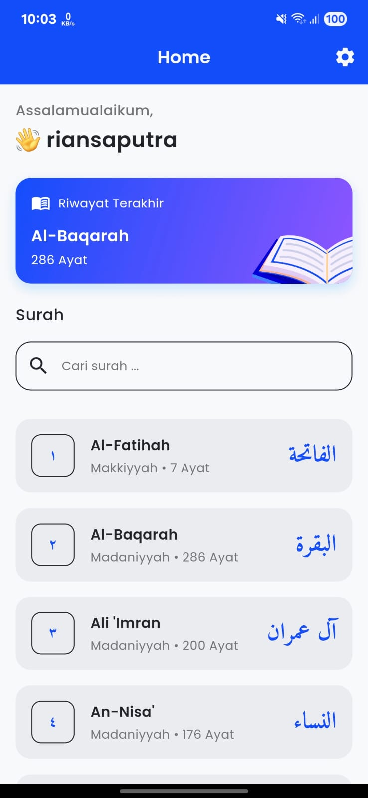

<div align="center">

# 📖 Iqraaku

### Modern Quran App for Mobile

<a href="https://youtube.com/shorts/m75agrkk4nc" target="_blank">
  
</a>

</div>

## 📖 Deskripsi

Iqraaku adalah aplikasi Al-Qur'an modern yang membantu Anda membaca, memahami, dan menghafal Al-Qur'an dengan mudah. Dibangun dengan Flutter, aplikasi ini menawarkan pengalaman pengguna yang bersih, responsif, dan kaya fitur, baik di perangkat mobile Android maupun iOS.

## ✨ Fitur Utama

- 📚 **Daftar Surah**: Menampilkan seluruh surah Al-Qur'an lengkap dengan terjemahan dan audio.
- 📝 **Detail Surah**: Baca ayat per ayat, terjemahan, tafsir, dan dengarkan audio tilawah.
- 🕑 **Riwayat Terakhir**: Lanjutkan bacaan terakhir Anda.
- 🎨 **Tema Terang & Gelap**: Pilihan tema sesuai preferensi.
- 🌐 **Multi-Platform**: Dukungan Android, iOS, Web, Windows, macOS, dan Linux.
- ⚙️ **Pengaturan Pengguna**: Ganti nama, dan tema aplikasi.
- 🚀 **Onboarding**: Panduan singkat saat pertama kali menggunakan aplikasi.
- 🏁 **Splash Screen**: Tampilan pembuka aplikasi yang menarik.

## 🗂 Daftar Menu

- **Splash Screen**: Tampilan awal saat aplikasi dibuka.
- **Onboarding**: Welcome screen untuk pengguna.
- **Home**: Berisi salam, riwayat bacaan terakhir, dan daftar surah.
- **Detail Surah**: Menampilkan detail surah dan ayat-ayatnya.
- **User Preferences**: Pengaturan nama, dan tema.

## 🔗 API

Aplikasi ini menggunakan API publik berikut:

- [staticquran.vercel.app/api/v1/](https://staticquran.vercel.app/api/v1/)
  - **GET /surah**: Daftar seluruh surah (dengan dukungan query `lang` untuk bahasa)
  - **GET /surah/{number}**: Detail surah, ayat, terjemahan, tafsir, dan audio

## 🛠 Tech Stack & Tools

- **Flutter** (SDK >=3.4.1 <4.0.0)
- **State Management**: GetX
- **Networking**: Dio
- **Local Storage**: Hive
- **Code Generation**: Freezed, Json Serializable, Build Runner
- **UI**: Google Fonts, Flutter SVG, Shimmer, ScreenUtil
- **Splash & Icon**: flutter_native_splash, flutter_launcher_icons
- **Testing & Linting**: flutter_test, flutter_lints

## 🚀 Cara Menjalankan

```bash
# Clone repository
https://github.com/riansap/iqraaku.git
cd iqraaku

# Install dependencies
flutter pub get

# Jalankan aplikasi
dart run
# atau
flutter run
```

## 👨‍💻 Author

Rian Saputra - https://github.com/riansap
